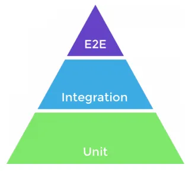

# Projeto: TAS-SDLC

Este repositório tem como objetivo criar uma solução de automação de teste (TAS) dentro de um Ciclo de Vida de Desenvolvimento de Software (SDLC) simulado, focado em um Sistema em Teste (SUT). O projeto foi idealizado para colocar em prática conceitos aprendidos durante os estudos para a certificação CTAL-TAE.

## Conceitos e temas relevantes em estudo

- **Workflows e GitHub Actions:** Como definir pipelines de automação para rodar testes em diferentes estágios do SDLC.
- **CI/CD:** Implantação de práticas de Integração Contínua e Entrega Contínua para garantir feedback rápido e qualidade do software.
- **Níveis de teste na prática:** Exploração da pirâmide de testes, começando pelos testes unitários e evoluindo para níveis superiores.

## Referências:
### Pirâmide de testes:

